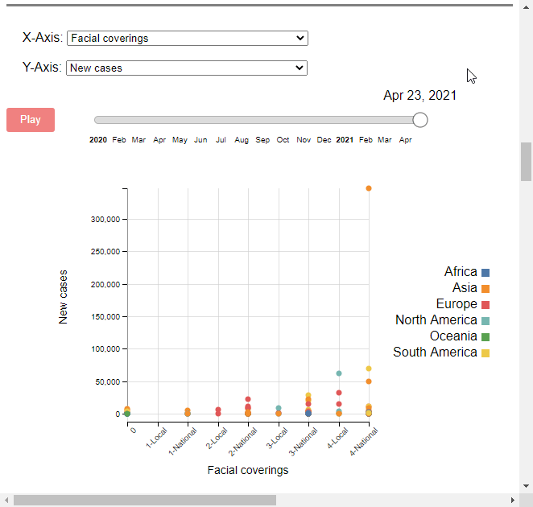

# Worldwide Trends in Covid-19

**View it live here**: https://willjobs.com/d3-covid.

**Note**: the data files are large, so the first time you load this page it may take a while to load. In addition, this site is best used on a computer 💻 (not a mobile device 📱).

This tool was built as part of a group project for a data visualizations class at UMass Amherst. It uses [D3.js](https://d3js.org/) (v6) for plots and [Leaflet](https://leafletjs.com/) combined with [mapbox](https://www.mapbox.com/) for maps.

---
## The visualization

The visualization site includes a description of the dataset at the top of the page and definitions of the attributes at the bottom (see [Background](#background)).

### The map

The first visualization is a combination of three visualizations: a choropleth map, a bar chart, and a line chart. Above the map, you can change the attribute using the dropdown menu, change the color scale on the map (described in detail below), and drag the date slider to view data at different points or click `Play` to see the date change automatically.

You can hover over the map to view a tooltip showing each country's exact value. They can click on a country to select it, or `Ctrl+click` to select multiple countries. Clicking elsewhere on the map will release the selection. The selected country(-ies) are shown with a pulsing color and animated dashed border. 

The countries selected on the map are shown in the bar chart and line chart below the map. The bar chart allows you to compare the magnitude of the selected attribute on the selected date. By default, the bar lengths are scaled with respect to the maximum value of the selected countries across the entire timeframe of the dataset. The `Scale max to selected date` checkbox (described more below) can be used to rescale the bars to the max of the selected countries on the selected date. You can hover anywhere along the bar to see the given country's value. If no data are available, this will be represented with the text "No data" to differentiate it from a value of zero.

The line chart shows the values for the selected countries over time. You can hover over the lines to see the value on the selected date. The cursor snaps to the nearest line based on the cursor's `(x,y)` position. If you want to focus on a single line, you can click on a given line, which will gray out all the other lines, allowing you to hover across the selected countries value and not snap to other lines. To go back, click again and it will release the selected line. The vertical dashed line shows the selected date; dragging the date slider or clicking `Play` will move this vertical line to the corresponding date's location.

**Note on color scales**: By default, the colors on the map are scaled linearly in proportion to the max value for the selected attribute across the entire timeframe of the dataset. This allows an apples-to-apples comparison across dates if the user wants to see how a country, or several countries, compare over time. Alternatively, the user can click the check box for `Scale max to selected date` to re-scale the colors on the map to the maximum value for the selected attribute on the selected date. This often shortens the range of the scale, making it easier to compare countries' colors on the selected date. As another alternative, you can click the checkbox for `Quantile color scale` to rescale such that the lowest 25% of values get the first 25% of the color range, etc. For more information on this kind of scale, see https://observablehq.com/@d3/sequential-scales. 

### The table

The table shows the latest data for the countries selected on the map. This would be helpful to a user who wants to get a snapshot of the data *today*, e.g., if they were planning a trip or comparing regions of the world at this moment. The table allows you to scroll across if there are many countries selected. You can change the category of attributes shown in the table using the dropdown menu. If the attribute selected on the map is in the category shown in the table, the attribute's row will be highlighted in blue.

### The scatterplot

The scatterplot allows users to examine the relationship between two attributes, across all countries, on any given date. You can hover over the dots to view a tooltip with the exact values. The attributes shown can be changed in the X-Axis and Y-Axis dropdown menus, and users can drag the date slider or click `Play` to see the dots move as time changes. By design, the scales change as the dates change, for two reasons: (1) the plot is intended to show the relationship at any moment in time, and (2) scaling to the maximum value across all countries and dates tends to compress all values towards the origin which makes it difficult to examine the relationship between attributes.

---
## Background
This series of visualizations helps illustrate trends in Covid-19 since January 1, 2020. It helps users gain an understanding of the trajectory of the virus (in terms of cases, deaths, hospitalizations, etc.) as well as society's response to and handling of the crisis. Users are also able to draw relationships between a society's policies and its Covid-19 outcomes.

There are two data sources for this project:
* The [*Oxford COVID-19 Government Response Tracker (OxCGRT)*](https://www.bsg.ox.ac.uk/research/research-projects/covid-19-government-response-tracker), created by the Blavatnik School of Government at the University of Oxford. This dataset provides information on government policies amidst the pandemic.

* The [*Our World in Data Covid-19 Dataset*](https://github.com/owid/covid-19-data/tree/master/public/data). This dataset provides information on daily and cumulative cases, deaths, hospitalized patients, ICU patients, tests, and vaccines administered. It also includes data on the economy, some health characteristics (e.g., prevalence of diabetes and smoking), and the country’s level of development.

Definitions of the attributes included in the visualization are included at the bottom of the [visualization site](https://willjobs.com/d3-covid).

In addition, the country polygons, in GeoJSON, were taken from https://datahub.io/core/geo-countries and simplified using [mapshaper](https://mapshaper.org), reducing the file size from 23 MB to 9 MB.

---
## Dataset Construction

See [data_downloader.py](https://github.com/willjobs/d3-covid/blob/main/data/data_downloader.py) for the code used to download and merge the datasets described above. This can be re-run any time; the underlying datasets are updated daily. Note that the code only pulls data up until two weeks prior to when you run it. This is because some countries have delayed reporting which means their data will have missing values for many attributes until they update it. Filtering to up until two weeks ago makes the visualization of the "latest data" look less empty.

Some preprocessing was done to the data. This includes the following operations:

* Filtering the datasets to only the overlapping time region, in case one dataset has a wider timeframe than the other (they're usually off by one day).
* Filtering out countries that don't exist in both datasets.
* Filtering out regional data, because the visualization is focused on countries, not regions; regional data are not available everywhere; and only the OxCGRT dataset has regional data.
* For the OWID dataset, when dates are missing for a given country, the values for "static" columns (e.g., population, GDP, life expectancy, etc.) are populated with the value used elsewhere in the dataset. Note that the OxCGRT dataset has rows for every country for the entire timeframe of the dataset, even if there are no data for a given country until later date.
* In the OxCGRT dataset, ordinal variables having values like "2G" and "1T" were recoded so that "G" is replaced with "-National", and "T" is replaced with "-Local". For example "2G" becomes "2-National" and "1T" becomes "1-Local". In addition certain special values in two columns were replaced: for h7_combined, "1I" was recoded as "1-National"; for e1_combined, "A" was recoded as "-National" and "F" was recoded as "-Local".
* Negative values are usually the result of countries going back and revising their data. In this visualization, negative values are truncated at zero.
